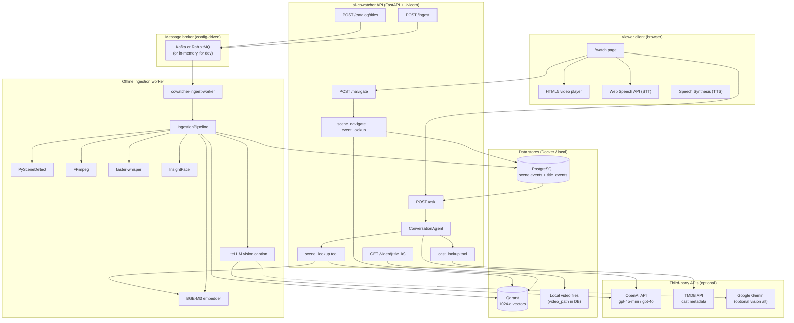
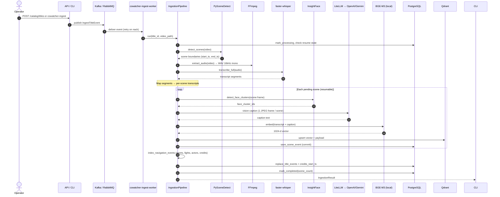
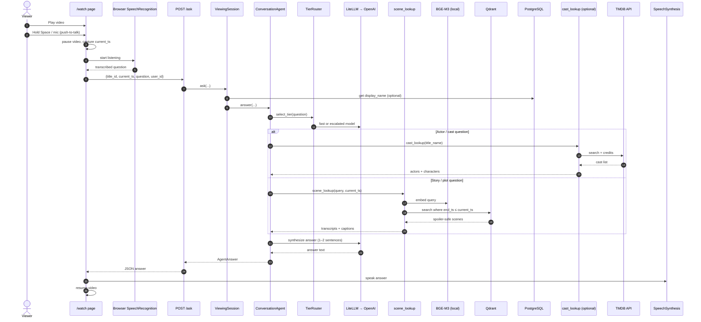
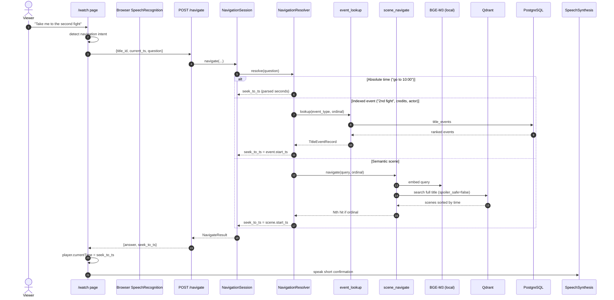
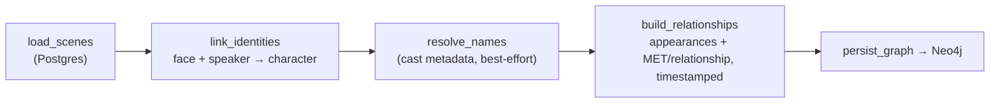
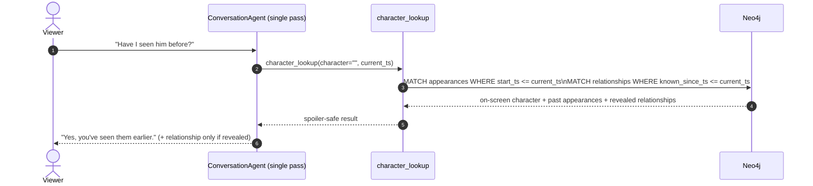

# AI Co-watcher — End-to-End Architecture

**Project:** ai-cowatcher (Pay-TV co-watcher pilot)  
**Version:** 0.1.0  
**Document date:** July 2026  
**Purpose:** Printable reference for architecture, data flow, services, and cost model.

---

## 1. Executive summary

AI Co-watcher is a **spoiler-safe TV companion**. It works in two phases:

1. **Offline ingestion (once per title)** — Detect scenes, transcribe audio, detect faces, caption frames with a vision LLM, embed text, and index everything in **PostgreSQL + Qdrant**.
2. **Real-time Q&A (per viewer question)** — A conversation agent calls `scene_lookup` (semantic search with `end_ts ≤ current_ts` spoiler guard), `character_lookup` (spoiler-safe character intelligence from Neo4j), and optionally `cast_lookup` (TMDB public cast metadata). Answers are short and conversational.
3. **Navigation (jump playback)** — `POST /navigate` resolves “go to 10:00”, “2nd fight”, “credits”, or “where does X appear” to a `seek_to_ts`. Uses indexed `title_events` (sports, fights, actor appearances, credits) plus full-title semantic search **without** the spoiler filter.

A **watch webpage** (`GET /watch`) plays the ingested video, captures voice questions (browser STT), routes navigation questions to `/navigate` (seek + TTS) or Q&A to `/ask` (pause, answer, resume).

---

## 2. High-level system diagram




---

## 3. Sequence diagram — offline ingestion

Runs once per title via `cowatcher-ingest` (direct), `POST /catalog/titles`, or `POST /ingest` (both publish an event to the message broker). A separate `**cowatcher-ingest-worker**` process consumes events and runs the resumable pipeline.

**Broker choice** (`MESSAGE_BROKER`): `memory` (local dev/tests), `rabbitmq` (smaller deployments), or `kafka` (larger scale). Producer and consumer share the same interface.

**Resumability:** each scene is committed to Postgres immediately (`save_scene_event`). If a worker pod dies mid-job, the broker redelivers the event; the pipeline skips `existing_scene_ids` and continues from the last persisted scene.




**Resilience features:** per-scene DB commit, resume without `--force`, vision API throttle + retry on 429.

---

## 4. Sequence diagram — real-time Q&A (watch flow)




**Spoiler safety:** enforced only in Qdrant retrieval (`end_ts ≤ current_ts`). Cast lookup uses public TMDB metadata (not plot spoilers).

---

## 4b. Sequence diagram — navigation (watch flow)

When the viewer asks to **jump** (“go to 10:00”, “2nd fight”, “credits”, “where does Ross appear”), the watch UI calls `POST /navigate` instead of `/ask`.




**Navigation vs Q&A:** navigation allows forward jumps across the full title; Q&A keeps the spoiler guard.

---

## 4c. Character intelligence (offline enrichment + `character_lookup`)

Character intelligence is a **tool the single conversation agent can call**, not a
separate agent. The orchestrator decides — in the same reasoning pass — whether a
question needs `scene_lookup`, `character_lookup`, `cast_lookup`, or a combination.

### Offline: speaker diarization + LangGraph enrichment

During ingest, **pyannote.audio** speaker diarization runs alongside **InsightFace**
face clustering, so each `SceneEvent` records both the active `face_cluster_ids` and
`speaker_cluster_ids`. After scenes are persisted, a **LangGraph** graph builds the
character graph in **Neo4j**:




Neo4j model (every edge/appearance is timestamped):

- `(:Character {id, name, face_cluster_ids, speaker_cluster_ids, first_ts})`
- `(:Character)-[:APPEARS_IN {start_ts, end_ts}]->(:Scene)`
- `(:Character)-[:RELATIONSHIP {rel_type, summary, known_since_ts, scene_id}]->(:Character)`

`known_since_ts` is the **spoiler anchor**: the earliest playback position at which a
relationship is revealed (first shared scene, or the scene whose dialogue states it,
e.g. "you're my sister").

### Real-time: spoiler-safe `character_lookup`




**Spoiler safety** is enforced identically to `scene_lookup`: the Neo4j query only
returns appearances and relationships with `timestamp <= current_ts`. An empty
`character` argument resolves to whoever is currently on screen (models "him"/"her").
Asking *"have I seen him before?"* before two characters' relationship is revealed
returns the prior appearances **without** the relationship; the same question after
the reveal surfaces it.

---

## 5. Service & component inventory

### 5.1 Application services (this repo)


| Component                      | Role                                                                     | Used in E2E?  |
| ------------------------------ | ------------------------------------------------------------------------ | ------------- |
| **FastAPI + Uvicorn**          | HTTP API (`/ask`, `/navigate`, `/ingest`, `/watch`, `/titles`, `/video`) | Yes           |
| **IngestionPipeline**          | Offline enrich + index                                                   | Yes           |
| **ConversationAgent**          | Tool-calling LLM orchestrator                                            | Yes           |
| **ViewingSession**             | `/ask` coordinator + telemetry                                           | Yes           |
| **SceneLookupTool**            | Semantic retrieval + spoiler filter                                      | Yes           |
| **CharacterLookupTool**        | Spoiler-safe character intelligence (Neo4j)                              | Yes           |
| **CharacterGraph (LangGraph)** | Offline face+speaker → character enrichment                              | Yes (offline) |
| **SceneNavigateTool**          | Full-title semantic search (no spoiler filter)                           | Yes           |
| **EventLookupTool**            | Indexed sports / fight / credits / actor events                          | Yes           |
| **NavigationResolver**         | Deterministic seek resolution (time, ordinal, events)                    | Yes           |
| **CastLookupTool**             | TMDB cast search                                                         | Optional      |
| **LiteLLM**                    | Unified LLM router (OpenAI, Gemini, Anthropic)                           | Yes           |


### 5.2 Infrastructure (Docker Compose)


| Service           | Image                   | Role in pilot                                                                    | Billing                                               |
| ----------------- | ----------------------- | -------------------------------------------------------------------------------- | ----------------------------------------------------- |
| **PostgreSQL 16** | `postgres:16-alpine`    | Title metadata, scene events, `title_events`, `credits_start_ts`, `display_name` | **Free** (self-hosted)                                |
| **Qdrant 1.12**   | `qdrant/qdrant:v1.12.5` | Vector search (BGE-M3, 1024-d, cosine)                                           | **Free** (self-hosted); paid if Qdrant Cloud          |
| **Neo4j 5**       | `neo4j:5.26-community`  | Character intelligence graph (identities, appearances, relationships)            | **Free** (self-hosted); paid if Aura                  |
| **Redis 7**       | `redis:7-alpine`        | Health check only (not in hot path yet)                                          | **Free** (self-hosted)                                |
| **MinIO**         | `minio/minio`           | Provisioned; **not used** in current code path                                   | **Free** (self-hosted); videos use local `video_path` |


### 5.3 Local ML / media tools (no per-request API fee)


| Tool                          | Purpose                      | License / cost                         |
| ----------------------------- | ---------------------------- | -------------------------------------- |
| **PySceneDetect**             | Scene boundary detection     | **Free** (open source)                 |
| **FFmpeg**                    | Audio extraction             | **Free**                               |
| **faster-whisper**            | Speech-to-text (ingest)      | **Free** (local CPU/MPS)               |
| **InsightFace** (`buffalo_l`) | Face detection / clustering  | **Free** (local, ONNX)                 |
| **pyannote.audio**            | Speaker diarization (ingest) | **Free** (local; gated HF model)       |
| **BGE-M3** (`BAAI/bge-m3`)    | Text embeddings (1024-d)     | **Free** (local, Hugging Face weights) |
| **OpenCV**                    | Frame grab at scene midpoint | **Free**                               |


### 5.4 Third-party cloud APIs


| Provider             | Usage                                                    | Default model                     | Billing                                |
| -------------------- | -------------------------------------------------------- | --------------------------------- | -------------------------------------- |
| **OpenAI**           | Vision captions (ingest); conversation `/ask`            | `gpt-4o-mini`; escalated `gpt-4o` | **Paid** (per token)                   |
| **Google Gemini**    | Optional vision captions via LiteLLM                     | `gemini-2.0-flash-lite`           | **Paid** (per token; free tier limits) |
| **Anthropic**        | Optional LLM fallback (configured, not default hot path) | Claude Haiku                      | **Paid**                               |
| **TMDB**             | Cast / actor lookup (`cast_lookup`)                      | REST API v3                       | **Free** (API key required)            |
| **Google (browser)** | Web Speech API STT in Chrome                             | Cloud speech (client-side)        | **Free** to end user*                  |
| **Browser TTS**      | `speechSynthesis`                                        | OS voices                         | **Free**                               |


Chrome sends audio to Google for recognition; no direct charge to your OpenAI bill.

### 5.5 Free vs paid summary


| Category                       | Examples                                                                                                   |
| ------------------------------ | ---------------------------------------------------------------------------------------------------------- |
| **Free (self-hosted / local)** | Postgres, Qdrant, Redis, MinIO, FFmpeg, Whisper, InsightFace, BGE-M3, PySceneDetect, TMDB, browser STT/TTS |
| **Paid (usage-based)**         | OpenAI vision + chat tokens; optional Gemini / Anthropic                                                   |
| **Paid (if you scale infra)**  | Managed Postgres, Qdrant Cloud, GPU hosts, CDN for video                                                   |


---

## 6. Data model (simplified)

```
title_ingestions
  ├── title_id (PK)
  ├── display_name        ← human title (TMDB / UI)
  ├── video_path          ← local MP4/WebM path
  ├── status              ← pending | processing | completed | failed
  └── scene_count

scene_events (per scene)
  ├── scene_id, title_id, start_ts, end_ts
  ├── transcript          ← from Whisper
  ├── caption             ← from vision LLM
  └── face_cluster_ids    ← from InsightFace

Qdrant point (per scene)
  ├── vector[1024]        ← BGE-M3(transcript + caption)
  └── payload: title_id, scene_id, start_ts, end_ts, transcript, caption, faces
```

---

## 7. API surface


| Method | Path                | Purpose                                        |
| ------ | ------------------- | ---------------------------------------------- |
| GET    | `/watch`            | Interactive watch + voice Q&A page             |
| GET    | `/titles`           | List completed ingested titles                 |
| GET    | `/video/{title_id}` | Stream video (HTTP Range)                      |
| POST   | `/ask`              | Real-time co-watcher question                  |
| POST   | `/catalog/titles`   | Register title + publish ingest event          |
| POST   | `/ingest`           | Publish ingest event (legacy enqueue endpoint) |
| GET    | `/health`           | Dependency + config health                     |
| GET    | `/metrics-lite`     | Pilot KPIs (latency, escalation rate)          |


---

## 8. Cost model — 30-minute title + 10 questions per watch

**Assumptions (adjust to your content):**


| Parameter                   | Low                       | Typical                             | High (fast-cut drama) |
| --------------------------- | ------------------------- | ----------------------------------- | --------------------- |
| Runtime                     | 30 min                    | 30 min                              | 30 min                |
| Scenes detected             | 60 (~2/min)               | 150 (~5/min)                        | 500 (~17/min)         |
| Vision model                | `gpt-4o-mini`             | `gpt-4o-mini`                       | `gpt-4o-mini`         |
| Vision tokens / scene       | ~1,500 in + 120 out       | ~2,000 in + 150 out                 | ~2,500 in + 200 out   |
| `/ask` model                | 100% fast (`gpt-4o-mini`) | 90% fast / 10% escalated (`gpt-4o`) | same                  |
| Questions per watch session | 10                        | 10                                  | 10                    |
| LLM tokens per question     | ~2,500 in + 120 out       | ~3,500 in + 150 out                 | ~4,000 in + 180 out   |
| Cast lookups                | 0                         | 1                                   | 2                     |


**Reference pricing (OpenAI, approximate — verify on [openai.com/pricing](https://openai.com/pricing)):**

- `gpt-4o-mini`: ~$0.15 / 1M input tokens, ~$0.60 / 1M output tokens  
- `gpt-4o`: ~$2.50 / 1M input, ~$10.00 / 1M output  
- Vision images billed as input tokens (512px frame ≈ hundreds–low thousands of tokens)

### 8.1 One-time ingestion cost (30 min title)


| Scenario               | Scenes | Vision API cost (est.) | Whisper / faces / embed (local) | **Ingest total**   |
| ---------------------- | ------ | ---------------------- | ------------------------------- | ------------------ |
| Low                    | 60     | ~$0.02 – $0.05         | $0 (your hardware)              | **~$0.02 – $0.05** |
| Typical                | 150    | ~$0.08 – $0.20         | $0                              | **~$0.08 – $0.20** |
| High (your clip style) | 500    | ~$0.25 – $0.75         | $0                              | **~$0.25 – $0.75** |


**Notes:**

- Ingest cost is **paid once per title** (amortized across unlimited viewers).
- Scene count dominates cost — tuning PySceneDetect thresholds can **cut spend 3–10×**.
- Throttle (`VISION_CAPTION_DELAY_SEC=1`) avoids 429s but does not reduce total tokens.
- Local Whisper on CPU for 30 min: ~5–15 min wall time, electricity only.

### 8.2 Per watch session — 10 questions


| Component                              | Cost per question (fast) | 10 questions        |
| -------------------------------------- | ------------------------ | ------------------- |
| BGE-M3 embed + Qdrant search           | $0                       | $0                  |
| `gpt-4o-mini` answer (1–2 tool rounds) | ~$0.0004 – $0.001        | **~$0.004 – $0.01** |
| TMDB cast lookup (if used)             | $0                       | $0                  |
| Browser STT / TTS                      | $0                       | $0                  |


**If 2 of 10 questions escalate to `gpt-4o`:**

- Add ~$0.01 – $0.03 per escalated question → **+$0.02 – $0.06** per session.

### 8.3 Combined example (typical TV episode)


| Item                                                             | Estimate                        |
| ---------------------------------------------------------------- | ------------------------------- |
| Ingest 30 min (150 scenes, gpt-4o-mini vision)                   | **~$0.10 – $0.20** (one time)   |
| 1 viewer, 10 questions (all fast tier)                           | **~$0.005 – $0.01**             |
| 1,000 viewers × 10 questions each (same title, already ingested) | **~$5 – $10** LLM only          |
| **First viewer all-in**                                          | **~$0.11 – $0.21**              |
| **Nth viewer (ingest amortized)**                                | **~$0.005 – $0.01** per session |


### 8.4 What is NOT in these estimates

- Cloud GPU / Mac electricity for local ML  
- Video storage / CDN bandwidth  
- Qdrant Cloud or managed Postgres  
- OpenAI rate-limit retries (same tokens, retried calls)  
- Engineering time for scene-merge tuning

---

## 9. Deployment topology (pilot)

```
┌─────────────────────────────────────────────────────────────┐
│  Developer laptop / single server                           │
│  ┌──────────────┐  ┌─────────┐  ┌─────────┐  ┌──────────┐ │
│  │ cowatcher-api│  │ Postgres│  │ Qdrant  │  │ Redis*   │ │
│  │  :8000       │  │  :5432  │  │  :6333  │  │  :6379   │ │
│  └──────┬───────┘  └─────────┘  └─────────┘  └──────────┘ │
│         │                                                    │
│  ┌──────▼───────┐         Local video files on disk          │
│  │ /watch UI   │◄─────── (path stored in Postgres)          │
│  └─────────────┘                                            │
└───────────────────────────┬─────────────────────────────────┘
                            │ HTTPS
              ┌─────────────▼─────────────┐
              │ OpenAI API (vision + chat)│
              │ TMDB API (cast, optional) │
              └───────────────────────────┘

* Redis: health probe only in current build
```

---

## 10. Security & spoiler model


| Concern       | Mechanism                                                       |
| ------------- | --------------------------------------------------------------- |
| Plot spoilers | Qdrant filter `end_ts ≤ current_ts` on every `scene_lookup`     |
| Hallucination | System prompt: only use tool results; say "don't know" if empty |
| Cast / actors | TMDB public metadata allowed (not considered plot spoilers)     |
| API keys      | `.env` — never committed; LiteLLM reads `OPENAI_API_KEY`, etc.  |


---

## 11. Supported video formats


| Format                    | Ingest              | Browser `/watch`                  |
| ------------------------- | ------------------- | --------------------------------- |
| **MP4** (H.264 + AAC)     | ✅ Recommended       | ✅ All browsers                    |
| **WebM** (VP8/VP9 + Opus) | ✅ Via FFmpeg/OpenCV | ✅ Chrome/Firefox (Safari limited) |
| **MOV, MKV**              | ✅ If FFmpeg decodes | Depends on codec                  |


---

## 12. Glossary


| Term               | Meaning                                                            |
| ------------------ | ------------------------------------------------------------------ |
| **Scene**          | Time range `[start_ts, end_ts]` — unit of search and spoiler guard |
| **Scene event**    | Scene + transcript + caption + face clusters + vector              |
| **current_ts**     | Viewer playback position (seconds) sent with each `/ask`           |
| **Fast tier**      | `gpt-4o-mini` for simple factual questions                         |
| **Escalated tier** | `gpt-4o` for nuanced "why / explain / theme" questions             |
| **MOCK_MODE**      | Local mocks — no paid API calls (dev/tests)                        |


---

## 13. Print notes

- Open this file in VS Code / GitHub and **Print → Save as PDF**, or use `pandoc docs/E2E_ARCHITECTURE.md -o architecture.pdf`.
- Mermaid diagrams render in GitHub, VS Code (with extension), and many Markdown viewers.
- For a slide-friendly one-pager, use sections 2, 5, and 8 only.

---

*Generated for the ai-cowatcher pilot. Pricing figures are estimates; verify current provider rates before budgeting.*