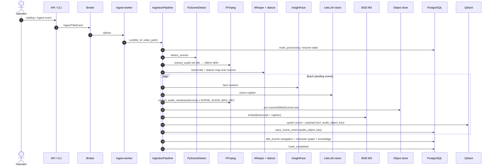

# AI Co-watcher — End-to-End Architecture

**Project:** ai-cowatcher (Pay-TV co-watcher pilot)  
**Version:** 0.2.0 (aligned with codebase)  
**Document date:** August 2026  
**Purpose:** Printable reference for architecture, data flow, services, and cost model.

---

## 1. Executive summary

AI Co-watcher is a **spoiler-safe TV companion**. Core phases:

1. **Offline ingestion (once per title)** — Detect scenes, extract full-title audio, transcribe + diarize, cluster faces, vision-caption frames, **slice & store per-scene audio clips**, embed text (`transcript + caption`), write **PostgreSQL + Qdrant**, optional **Neo4j** character graph and curated knowledge index.
2. **Real-time Q&A (per viewer utterance)** — Browser ambient listen (or type) → optional utterance gate → **ConversationAgent** tool loop (`scene_lookup`, `character_lookup`, `cast_lookup`, `knowledge_search`, `user_memory`) with spoiler filters → **text and/or multimodal** answer using retrieved **scene WAV clips** → short reply (optional TTS).
3. **Navigation (jump playback)** — `POST /navigate` resolves clock seeks, “Nth fight”, credits, actor appearances; full-title search **without** spoilers.

A **watch UI** (`GET /watch`) plays video, **listens continuously** while a title is loaded (session STT with cool-downs), keeps playback running, and streams answers over **`POST /ask/stream`** (SSE).

---

## 2. High-level system diagram


```mermaid
flowchart TB
    subgraph Client["Viewer (browser)"]
        WATCH["GET /watch"]
        VIDEO["HTML5 video"]
        STT["Web Speech API\n(session STT + cool-down)"]
        TTS["SpeechSynthesis\n(one-shot TTS)"]
    end

    subgraph API["FastAPI + Uvicorn"]
        ASK["POST /ask"]
        ASKSTREAM["POST /ask/stream SSE"]
        NAV["POST /navigate"]
        CATALOG["POST /catalog/titles"]
        INGESTAPI["POST /ingest"]
        STREAM["GET /video/{title_id}"]
        GATE["Utterance gate"]
        AGENT["ConversationAgent"]
        JOKE["Joke path"]
        MM["Multimodal answer\n(text + scene WAVs)"]
    end

    subgraph Tools["Agent tools"]
        SL["scene_lookup"]
        CH["character_lookup"]
        CAST["cast_lookup"]
        KNOW["knowledge_search"]
        MEM["user_memory"]
        NAVR["navigate resolver"]
    end

    subgraph Offline["Ingest worker"]
        WORKER["cowatcher-ingest-worker"]
        PIPE["IngestionPipeline"]
        SCENE["PySceneDetect"]
        FFMPEG["FFmpeg title + window audio"]
        WHISPER["faster-whisper"]
        DIAR["pyannote diarization"]
        FACE["InsightFace"]
        VISION["LiteLLM vision caption"]
        EMBED["BGE-M3"]
        OBJPUT["Object store put\nscene WAV"]
    end

    subgraph Data["Stores"]
        PG[("PostgreSQL")]
        QD[("Qdrant scenes + knowledge")]
        N4J[("Neo4j characters")]
        REDIS[("Redis user memory cache")]
        OBJ[("Object store\nlocal dir or MinIO")]
        FS["Local video files"]
    end

    subgraph Cloud["Cloud LLMs via LiteLLM"]
        GEMINI["Gemini Flash\nchat + multimodal audio"]
        VISAPI["Vision captions"]
        TMDB["TMDB cast"]
    end

    WATCH --> VIDEO & STT & TTS
    WATCH --> ASKSTREAM & NAV
    ASK --> GATE --> AGENT
    ASKSTREAM --> GATE --> AGENT
    AGENT --> JOKE
    AGENT --> SL & CH & CAST & KNOW & MEM
    AGENT --> MM
    SL --> EMBED & QD
    MM --> OBJ & GEMINI
    NAV --> NAVR --> QD & PG
    CATALOG & INGESTAPI --> WORKER
    WORKER --> PIPE
    PIPE --> SCENE & FFMPEG & WHISPER & DIAR & FACE & VISION & EMBED & OBJPUT
    OBJPUT --> OBJ
    PIPE --> PG & QD & N4J
    VISION --> VISAPI
    AGENT --> GEMINI
    CAST --> TMDB
    STREAM --> FS
    MEM --> PG & REDIS
```

---

## 3. Sequence diagram — offline ingestion

**Triggers:** `cowatcher-ingest` CLI, `POST /catalog/titles`, or `POST /ingest` → broker → **`cowatcher-ingest-worker`**.

**Broker** (`MESSAGE_BROKER`): `memory` | `rabbitmq` | `kafka`.

**Resumability:** each scene is committed immediately; redelivery skips existing `scene_id`s.


```mermaid
sequenceDiagram
    autonumber
    actor Operator
    participant API as API / CLI
    participant MQ as Broker
    participant Worker as ingest-worker
    participant Pipe as IngestionPipeline
    participant SD as PySceneDetect
    participant FF as FFmpeg
    participant WH as Whisper + diarize
    participant IF as InsightFace
    participant LLM as LiteLLM vision
    participant BGE as BGE-M3
    participant OBJ as Object store
    participant PG as PostgreSQL
    participant QD as Qdrant

    Operator->>API: catalog / ingest event
    API->>MQ: IngestTitleEvent
    MQ->>Worker: deliver
    Worker->>Pipe: run(title_id, video_path)
    Pipe->>PG: mark_processing / resume state
    Pipe->>SD: detect_scenes
    Pipe->>FF: extract_audio full title → 16kHz WAV
    Pipe->>WH: transcribe + diarize map onto scenes

    loop Each pending scene
        Pipe->>IF: face clusters
        Pipe->>LLM: vision caption
        Pipe->>FF: extract_audio_window(start,end) ≤ SCENE_AUDIO_MAX_SEC
        Pipe->>OBJ: put scenes/{title}/{scene}.wav
        Pipe->>BGE: embed(transcript + caption)
        Pipe->>QD: upsert vector + payload (incl. audio_object_key)
        Pipe->>PG: save_scene_event (audio_object_key)
    end

    Pipe->>PG: title_events navigation + character graph + knowledge
    Pipe->>PG: mark_completed
```

**Resilience:** per-scene commit, resume without force, vision throttle/retry, scene audio optional (failure logs; text still indexed).

---

## 4. Sequence diagram — real-time Q&A

```mermaid
sequenceDiagram
    autonumber
    actor Viewer
    participant UI as /watch
    participant STT as Browser STT
    participant SSE as POST /ask/stream
    participant Gate as Utterance gate
    participant Agent as ConversationAgent
    participant Tier as TierRouter
    participant SL as scene_lookup
    participant BGE as BGE-M3
    participant QD as Qdrant
    participant OBJ as Object store
    participant LLM as Gemini multimodal / chat
    participant TTS as SpeechSynthesis

    Viewer->>UI: Play title (mic ambient)
    UI->>STT: session listen continuous=false + cool-down
    STT-->>UI: final utterance
    UI->>SSE: {title_id, current_ts, question, user_id}

    SSE->>Gate: classify (filler / social / joke / navigate / content)
    alt Ignore filler
        Gate-->>UI: empty answer, speak=false
    else Social / off-topic
        Gate-->>UI: short canned reply
    else Joke intent
        Agent->>SL: scene_lookup (banter query)
        Agent->>LLM: joke-mode short line
    else Content
        Agent->>Tier: fast model default
        Agent->>SL: scene_lookup(query, current_ts)
        Note over SL,QD: Filter start_ts ≤ current_ts (scene started)
        SL->>BGE: embed query
        SL->>QD: search
        QD-->>Agent: scenes + audio_object_key
        opt MULTIMODAL_SCENE_AUDIO_ENABLED
            Agent->>OBJ: get WAV bytes top-K
            Agent->>LLM: text evidence + input_audio clips
        else Text-only fallback
            Agent->>LLM: tool text → brief friend answer
        end
    end

    SSE-->>UI: status / tool_* / token / done
    UI->>TTS: one-shot speak if speak=true
    Note over UI: Video keeps playing (no pause-to-ask)
```

**Spoiler safety (retrieval):**

- **Qdrant scenes:** only scenes with `start_ts ≤ current_ts` (includes the in-progress scene; excludes future starts).
- **Characters (Neo4j):** appearances / relationships with timestamp ≤ `current_ts`.
- **Navigation:** no spoiler filter (intentional forward seek).

Cast / public knowledge tools are not plot spoilers.

---

## 4b. Sequence diagram — navigation

Watch UI detects navigate intents (clock, “Nth fight”, credits, “where does X appear”) → `POST /navigate` → `NavigationResolver` (time parse → `title_events` → full-title `scene_navigate`) → `seek_to_ts` + short answer. Client may seek absolute clock locally for instant feedback.

**Warm process:** app lifespan builds **shared** embedder + Qdrant client used by both `ViewingSession` and `NavigationSession` (Phase A).

---

## 4c. Streaming, gate, joke mode, multimodal

| Path | Behavior |
|------|----------|
| **`POST /ask`** | Full JSON `AgentAnswer` after tool loop |
| **`POST /ask/stream`** | SSE: `status`, `tool_start`/`tool_end`, `token`, `done`/`error`; memory deferred off critical path |
| **Utterance gate** | Free heuristics for clear filler/social/navigate; **merged** strategy = single LLM call with first-line intent tags `[FILLER]`/`[SOCIAL]`/`[JOKE]`/`[NAVIGATE]`/`[CONTENT]` then answer in the same stream (`UTTERANCE_GATE_STRATEGY=merged`) |
| **Joke** | Explicit phrases or `[JOKE]` tag → short scene-grounded line |
| **Multimodal** | After scene tools return `audio_object_key`, load ≤ `MULTIMODAL_MAX_CLIPS` WAVs → LiteLLM multimodal messages (`input_audio`) |
| **Cast** | Extracted once at **ingest** from TMDB → stored on `title_ingestions.cast_cache` + Redis hot cache; `cast_lookup` serves cache at ask-time (live TMDB only on miss) |
| **Q&A cache** | Exact (Redis/memory) + semantic (Qdrant `qa_cache`); skips retrieval + LLM on hit within same 30s playhead bucket |
| **Grounding fallback** | If model refuses but tools have text → grounded short rewrite |

---

## 4d. Character intelligence

Unchanged principle: single agent tools, not a second agent. Offline LangGraph → Neo4j with timestamped `APPEARS_IN` / `RELATIONSHIP`. Live `character_lookup` filters by `current_ts`.

---

## 5. Service & component inventory

### 5.1 Application (this repo)

| Component | Role |
|-----------|------|
| **FastAPI + Uvicorn** | `/ask`, `/ask/stream`, `/navigate`, `/catalog`, `/ingest`, `/watch`, `/titles`, `/video`, `/health`, metrics |
| **IngestionPipeline** | Offline enrich + scene audio + dual write |
| **ObjectStore** | Local filesystem or MinIO for scene WAVs |
| **ConversationAgent** | Gate + tools + joke + multimodal + brevity |
| **ViewingSession** | `/ask` orchestrator, telemetry, deferred memory |
| **NavigationSession** | Warm navigate path |
| **SceneLookupTool** | Spoiler-safe semantic search |
| **Character / cast / knowledge / user_memory tools** | As configured |
| **LiteLLM** | Vision ingest + conversation (+ multimodal) |

### 5.2 Infrastructure (Docker Compose)

| Service | Role |
|---------|------|
| **PostgreSQL** | `title_ingestions`, `scene_events` (+ `audio_object_key`), `title_events`, chat turns |
| **Qdrant** | Scene vectors + knowledge collection |
| **Neo4j** | Character graph (optional if down, soft fail) |
| **Redis** | User-memory cache + health |
| **MinIO** | Optional when `OBJECT_STORE_BACKEND=minio`; default pilot uses **local** `.cowatcher-objects/` |
| **Kafka / RabbitMQ** | Optional brokers (`MESSAGE_BROKER`) |

### 5.3 Local ML / media

| Tool | Purpose |
|------|---------|
| PySceneDetect | Scene bounds |
| FFmpeg | Full audio + **per-scene windows** |
| faster-whisper | Ingest ASR |
| pyannote | Diarization |
| InsightFace | Faces |
| BGE-M3 | Query + scene embeddings (warmed at API startup) |
| OpenCV | Mid-scene frame for captions |

### 5.4 Cloud APIs

| Provider | Usage |
|----------|--------|
| **Google Gemini** (default hot path) | Conversation + **multimodal audio** answers (`gemini/gemini-2.0-flash`); optional vision captions |
| **OpenAI** | Optional vision / alternate chat models via LiteLLM |
| **TMDB** | Cast lookup |
| **Browser STT/TTS** | Client-side listen + speak |

### 5.5 Free vs paid (summary)

| Category | Examples |
|----------|----------|
| Free / self-hosted | Postgres, Qdrant, Redis, local object store, Whisper, BGE, InsightFace, FFmpeg |
| Paid usage | Gemini (or OpenAI) tokens for vision + chat/multimodal; optional managed infra |

---

## 6. Data model (simplified)

```
title_ingestions
  ├── title_id, display_name, video_path
  ├── status, scene_count, credits_start_ts

scene_events
  ├── scene_id (= "{title_id}:{sNNNN}"), title_id
  ├── start_ts, end_ts
  ├── transcript, caption
  ├── face_cluster_ids, speaker_cluster_ids
  └── audio_object_key   ← e.g. scenes/{title}/{scene}.wav

Qdrant scene point
  ├── vector[1024] ← BGE-M3(transcript + caption)
  └── payload: times, transcript, caption, faces, speakers,
                 audio_object_key

Object store
  └── scenes/{title_id}/{scene_id}.wav   (PCM 16 kHz mono)

user_conversation_turns (+ Redis cache)
  └── (user_id, title_id) memory for user_memory tool
```

---

## 7. API surface

| Method | Path | Purpose |
|--------|------|---------|
| GET | `/watch` | Watch UI + ambient voice |
| GET | `/titles` | Completed titles |
| GET | `/video/{title_id}` | Range video stream |
| POST | `/ask` | Full JSON Q&A |
| POST | `/ask/stream` | SSE progressive Q&A |
| POST | `/navigate` | Seek resolver |
| POST | `/catalog/titles` | Register + enqueue ingest |
| POST | `/ingest` | Enqueue ingest |
| GET | `/health` | Dependencies + LLM flags |
| GET | `/metrics-lite` | Pilot KPIs |
| GET | `/metrics` | Prometheus |

---

## 8. Performance architecture (latency & memory)

| Technique | Why |
|-----------|-----|
| Warm embedder/sessions in **app lifespan** | Avoid cold BGE load per request |
| `asyncio.to_thread` on `/ask` & `/navigate` | Keep event loop free |
| SSE tokens + one-shot TTS | Perceived latency without progressive utterance piles |
| **Session STT** (`continuous=false`) + **cool-down** | Avoid Chromium continuous-STT memory blowups |
| Multimodal only **after** retrieval | Quality audio context without full-title audio |
| Cap `SCENE_AUDIO_MAX_SEC` / `MULTIMODAL_MAX_CLIPS` | Bound cost/latency of audio upload to cloud LLM |
| Prefer **Gemini Flash** online for chat+audio; leave Ollama for local experiments | Stability and multimodal capability |

---

## 9. Configuration highlights

| Area | Key env vars |
|------|----------------|
| Mock | `MOCK_MODE` |
| Conversation LLM | `LLM_TIER_FAST_MODEL`, `LLM_TIER_ESCALATED_MODEL` (default `gemini/gemini-2.0-flash`) |
| Multimodal | `MULTIMODAL_SCENE_AUDIO_ENABLED`, `MULTIMODAL_MAX_CLIPS` |
| Scene audio | `SCENE_AUDIO_ENABLED`, `SCENE_AUDIO_MAX_SEC` |
| Object store | `OBJECT_STORE_BACKEND` (`local`\|`minio`), `OBJECT_STORE_LOCAL_DIR`, `MINIO_*` |
| Utterance gate | `UTTERANCE_GATE_ENABLED`, `UTTERANCE_GATE_STRATEGY` (`heuristic` \| `prompt` \| **`merged`**) |
| Embeddings | `EMBEDDING_MODEL`, `EMBEDDING_DEVICE` |
| Broker | `MESSAGE_BROKER` |

Re-ingest with force when enabling scene audio for older titles so `audio_object_key` is populated.

---

## 10. Cost model notes (updated)

**Ingest (per title, one-time):** vision captions remain the dominant cloud cost; **scene audio storage** is local (or MinIO) and cheap; duration of clips is capped.

**Per session question:**

- Text tool loop + small Gemini reply: low cents fractions at pilot scale  
- Multimodal with 1–2 short WAVs: higher input cost / latency than text-only; gated by retrieval quality  

Exact rates: verify current [Gemini](https://ai.google.dev/pricing) / OpenAI pricing. Local Whisper/BGE remain electricity-only.

---

## 11. Deployment topology (pilot)

```
┌──────────────────────────────────────────────────────────────┐
│  Laptop / single host                                        │
│  uvicorn :8000  (warm BGE)   ingest-worker                   │
│  Postgres · Qdrant · Redis · Neo4j · optional MinIO/broker │
│  .cowatcher-objects/ or MinIO  ← scene WAVs                  │
│  video files on disk ─────► GET /video                       │
│  Browser ──── SSE /ask/stream · /navigate · /watch           │
└───────────────────────────┬──────────────────────────────────┘
                            │ HTTPS
              ┌─────────────▼──────────────┐
              │ Gemini (chat + multimodal) │
              │ Optional vision / TMDB     │
              └────────────────────────────┘
```

Prefer `make api` **without** uvicorn `--reload` when BGE is warm (avoids OOM double-load).

---

## 12. Security & spoiler model

| Concern | Mechanism |
|---------|-----------|
| Plot spoilers | Retrieval filters + prompt: only use tools/clips provided |
| Multimodal cloud | Scene audio leaves the host when using Gemini — treat licensing/PII carefully |
| Hallucination | Tools + grounded fallbacks; refuse future/unknown when empty |
| Secrets | `.env` not committed; LiteLLM keys `GEMINI_API_KEY` / `GOOGLE_API_KEY` / optional OpenAI |

---

## 13. Supported video formats

| Format | Ingest | `/watch` |
|--------|--------|----------|
| MP4 H.264+AAC | Recommended | All browsers |
| WebM | If FFmpeg/OpenCV decode | Chrome/Firefox |
| MOV/MKV | If FFmpeg decodes | Browser-dependent |

---

## 14. Glossary

| Term | Meaning |
|------|---------|
| **Scene** | Time range unit for index, spoilers, and audio clip |
| **audio_object_key** | Object-store path for that scene’s WAV |
| **current_ts** | Playback position sent with ask/navigate |
| **Utterance gate** | Pre-agent filter for noise / intents |
| **Multimodal answer** | LLM response from text evidence + retrieved scene audio |
| **Warm session** | Embedder + stores built once at API lifespan |
| **MOCK_MODE** | Local mocks; no paid LLM; multimodal skipped |

---

## 15. Related docs

- [OBSERVABILITY.md](./OBSERVABILITY.md) — metrics and alert thresholds  
- [README.md](../README.md) — quick start  
- `.env.example` — full env reference  

---

## 16. Print notes

- Print to PDF from GitHub/VS Code; Mermaid needs a renderer.  
- For a one-pager use sections **1–2**, **5**, and **8**.

---

*Aligned with the ai-cowatcher pilot codebase (scene audio, multimodal ask, stream, gate, ambient listen, Gemini defaults). Pricing is indicative only.*
