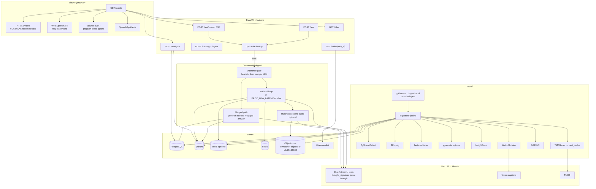
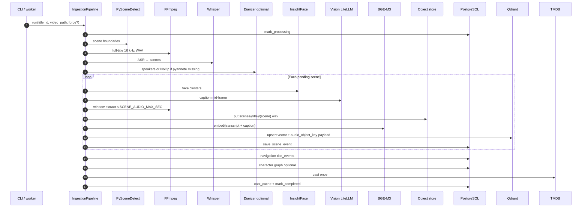
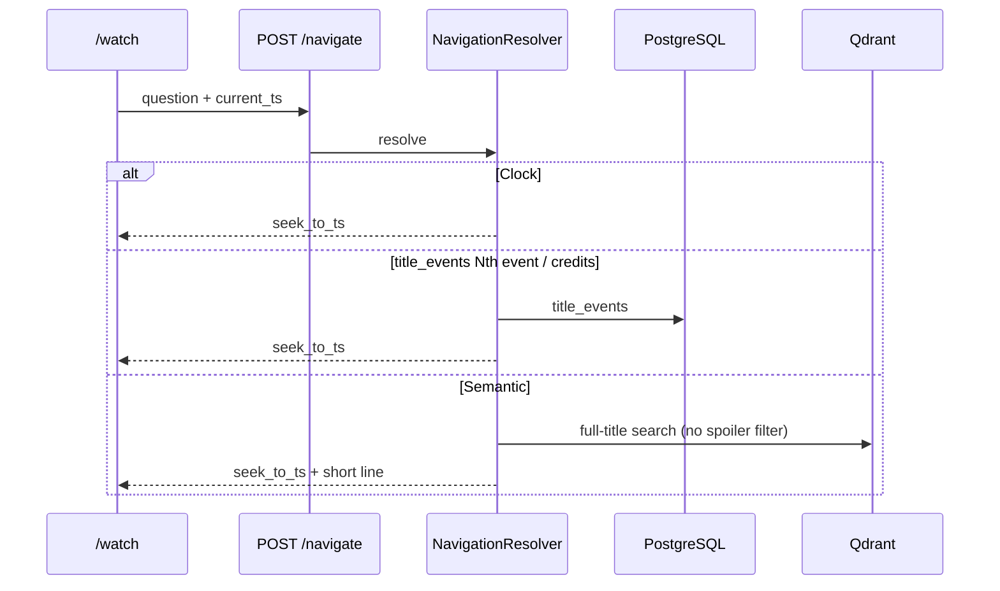

# AI Co-watcher — End-to-End Architecture

**Project:** ai-cowatcher (Pay-TV co-watcher pilot)  
**Version:** 0.3.0 (aligned with pilot codebase, Aug 2026)  
**Document date:** August 2026  
**Purpose:** Printable reference for current design, data flow, latency model, and configuration.

---

## 1. Executive summary

AI Co-watcher is a **spoiler-safe TV companion**. The pilot prioritizes a **demo-ready watch loop**: ingest once, answer quickly about *what is on screen now*, cast, and light navigation — without multi-hop LLM tool thrash.

### Core phases

1. **Offline ingestion (once per title)**  
   Detect scenes → full-title audio → ASR (Whisper) → optional speaker diarization → faces → vision captions → **per-scene WAV clips** → BGE-M3 embed → **PostgreSQL + Qdrant** → optional Neo4j character graph + knowledge + **TMDB cast cache** on the title.

2. **Real-time Q&A (per utterance)**  
   Browser **wake-word STT** (“Hey …”) or typed question → utterance gate → **pilot path: `PILOT_LOW_LATENCY` / `merged`** (one scene retrieve + one streamed Gemini answer) → optional TTS.  
   Full multi-tool agent remains available when pilot low-latency is off.

3. **Navigation**  
   `POST /navigate` for clock seeks, titled events, semantic seeks.

4. **Watch UI**  
   `GET /watch` — play video (Range stream), title dropdown (completed + on-disk paths only), duck program volume while talking, ambient mic with **Hey** wake word, SSE answers.

### Design priorities (pilot)

| Priority | Choice |
|----------|--------|
| Latency | **1 retrieve + 1 LLM** for content; avoid 3–4 Gemini rounds |
| Models | Current Gemini 3.x IDs (`gemini-3.5-flash-lite` / `gemini-3.6-flash`); 2.0/2.5 **retired for new keys** |
| Multimodal audio | **Off by default** (`MULTIMODAL_SCENE_AUDIO_ENABLED=false`) — text caption/transcript is enough for demos |
| Diarization | **Optional**; missing `pyannote` → empty speakers, ingest continues |
| Voice UX | **Hey** wake word so program audio is not treated as the user |

---

## 2. High-level system diagram


```mermaid
flowchart TB
    subgraph Client["Viewer (browser)"]
        WATCH["GET /watch"]
        VIDEO["HTML5 video\nH.264+AAC recommended"]
        STT["Web Speech API\nHey wake word"]
        DUCK["Volume duck /\nprogram-bleed ignore"]
        TTS["SpeechSynthesis"]
    end

    subgraph API["FastAPI + Uvicorn"]
        ASK["POST /ask"]
        ASKSTREAM["POST /ask/stream SSE"]
        NAV["POST /navigate"]
        CATALOG["POST /catalog · /ingest"]
        STREAM["GET /video/{title_id}"]
        TITLES["GET /titles"]
        CACHE["QA cache lookup"]
    end

    subgraph Agent["ConversationAgent"]
        GATE["Utterance gate\nheuristic then merged LLM"]
        MERGED["Merged path\nprefetch scenes + tagged answer"]
        TOOLS["Full tool loop\nif PILOT_LOW_LATENCY=false"]
        MM["Multimodal scene audio\noptional"]
    end

    subgraph Offline["Ingest"]
        CLI["python -m …ingestion.cli\nor make ingest"]
        PIPE["IngestionPipeline"]
        SD["PySceneDetect"]
        FF["FFmpeg"]
        WH["faster-whisper"]
        DIAR["pyannote optional"]
        FACE["InsightFace"]
        VIS["LiteLLM vision"]
        EMB["BGE-M3"]
        CASTI["TMDB cast → cast_cache"]
    end

    subgraph Data["Stores"]
        PG[("PostgreSQL")]
        QD[("Qdrant")]
        N4J[("Neo4j optional")]
        REDIS[("Redis")]
        OBJ[("Object store\n.cowatcher-objects or MinIO :19000")]
        FS["Video on disk"]
    end

    subgraph Cloud["LiteLLM → Gemini"]
        GEM["Chat / stream / tools\nthought_signature pass-through"]
        VISAPI["Vision captions"]
        TMDB["TMDB"]
    end

    WATCH --> VIDEO & STT & DUCK & TTS
    WATCH --> ASKSTREAM & NAV & TITLES
    ASK & ASKSTREAM --> CACHE
    CACHE -->|miss| GATE
    GATE --> MERGED
    GATE --> TOOLS
    MERGED --> QD & PG
    MERGED --> GEM
    TOOLS --> QD & N4J & REDIS & GEM
    TOOLS --> MM
    MM --> OBJ & GEM
    NAV --> QD & PG
    CLI --> PIPE
    PIPE --> SD & FF & WH & DIAR & FACE & VIS & EMB & CASTI
    PIPE --> PG & QD & N4J & OBJ
    STREAM --> FS
    CASTI --> TMDB
    VIS --> VISAPI
```

---

## 3. Offline ingestion

**Triggers**

- `make ingest TITLE=… VIDEO=… [FORCE=1]`
- `python -m ai_cowatcher.ingestion.cli --title-id … --video … [--force]`
- `POST /catalog/titles` or `POST /ingest` → broker → `python -m ai_cowatcher.ingestion.worker_cli`

**Broker** (`MESSAGE_BROKER`): `memory` (pilot default) | `rabbitmq` | `kafka` (compose uses `apache/kafka` KRaft image).

**Resumability:** each scene commits immediately; redelivery skips existing scene ids unless `--force`.


```mermaid
sequenceDiagram
    autonumber
    participant CLI as CLI / worker
    participant Pipe as IngestionPipeline
    participant SD as PySceneDetect
    participant FF as FFmpeg
    participant WH as Whisper
    participant DI as Diarizer optional
    participant IF as InsightFace
    participant LLM as Vision LiteLLM
    participant BGE as BGE-M3
    participant OBJ as Object store
    participant PG as PostgreSQL
    participant QD as Qdrant
    participant TMDB as TMDB

    CLI->>Pipe: run(title_id, video_path, force?)
    Pipe->>PG: mark_processing
    Pipe->>SD: scene boundaries
    Pipe->>FF: full-title 16 kHz WAV
    Pipe->>WH: ASR → scenes
    Pipe->>DI: speakers or NoOp if pyannote missing
    loop Each pending scene
        Pipe->>IF: face clusters
        Pipe->>LLM: caption mid-frame
        Pipe->>FF: window extract ≤ SCENE_AUDIO_MAX_SEC
        Pipe->>OBJ: put scenes/{title}/{scene}.wav
        Pipe->>BGE: embed(transcript + caption)
        Pipe->>QD: upsert vector + audio_object_key payload
        Pipe->>PG: save_scene_event
    end
    Pipe->>PG: navigation title_events
    Pipe->>PG: character graph optional
    Pipe->>TMDB: cast once
    Pipe->>PG: cast_cache + mark_completed
```

### Diarization (optional)

| Setting | Behavior |
|---------|----------|
| `DIARIZATION_ENABLED=true` | Prefer `pyannote` when `pip install '.[diarization]'` + HF token |
| Package / model missing | **Warning + empty speaker clusters**; ingest does not fail |
| Pilot stance | Diarization is **not** required for approval demos |

### Cast

- Extracted at **ingest** (TMDB live or mock in `MOCK_MODE`).  
- Stored on `title_ingestions.cast_cache` (+ optional Redis TTL).  
- `cast_lookup` at ask time: Redis → Postgres → TMDB fallback with write-through.

### Video for `/watch`

Browsers often fail on **AV1 + Opus** (silent audio or no play). Prefer **H.264 + AAC** for UI; ingest can still use the source file if FFmpeg decodes it. Store absolute `video_path` for stable streaming.

---

## 4. Real-time Q&A

### 4.1 Two agent modes

| Mode | When | Shape |
|------|------|--------|
| **Pilot / low latency** (default) | `PILOT_LOW_LATENCY=true` **or** `UTTERANCE_GATE_STRATEGY=merged` | Rules gate → **preload scenes** → **one** tagged Gemini stream: intent + short answer |
| **Full tool loop** | Pilot low-latency off and strategy `prompt` / classic | Multi-round tools (`character_lookup`, `scene_lookup`, …) — **3–4 LLM calls**; often **10–15s+** on Gemini 3 |

### 4.2 Pilot path (default) sequence

```mermaid
sequenceDiagram
    autonumber
    actor Viewer
    participant UI as /watch
    participant SSE as /ask/stream
    participant Cache as QA cache
    participant Gate as Free heuristics
    participant SL as scene_lookup
    participant QD as Qdrant
    participant LLM as Gemini stream
    participant TTS as TTS

    Viewer->>UI: typed or “Hey, who is on the screen?”
    UI->>SSE: title_id, current_ts, question

    SSE->>Cache: exact / semantic
    alt Hit
        Cache-->>UI: answer + done
    else Miss
        SSE->>Gate: filler / social / navigate short-circuit
        alt Content
            SSE->>SL: playhead-local OR embed search
            Note over SL,QD: spoiler: start_ts ≤ current_ts
            Note over SL: playhead path skips BGE for “on screen / just happened”
            SL-->>SSE: scenes (caption + transcript)
            SSE->>LLM: MERGED system + evidence → stream [CONTENT] + body
            Note over LLM: max_tokens headroom + reasoning_effort; thought_signature if tools used
            LLM-->>UI: token… done
        end
    end
    UI->>TTS: if speak and non-empty
```

### 4.3 Scene retrieval

| Query type | Strategy |
|------------|----------|
| **“Who/what is on screen”, “what just happened”, “going on”** | **Playhead-local** Qdrant scroll: prefer scene containing `current_ts`, then recent past — **no embedding** |
| Broader semantic questions | BGE-M3 embed query → ANN + spoiler filter |
| Full tool loop only | Agent may call `character_lookup` / `cast_lookup` / etc. |

Spoiler rule (scenes): only `start_ts ≤ current_ts`.  
Characters (Neo4j): appearances / relationships already “known” by `current_ts`.

### 4.4 Multimodal scene audio

| Flag | Behavior |
|------|----------|
| `MULTIMODAL_SCENE_AUDIO_ENABLED=false` (default pilot) | Text-only compose from captions/transcripts |
| `true` | After tools/scenes, load ≤ `MULTIMODAL_MAX_CLIPS` WAVs → Gemini `input_audio` |
| Compose rule | Multimodal runs only if the **text answer is missing or a refusal** — avoids a second full Gemini call when caption text already works |

### 4.5 Gate strategies

| `UTTERANCE_GATE_STRATEGY` | Behavior |
|---------------------------|----------|
| `heuristic` | Rules only — free |
| `prompt` | Rules + **extra Gemini YES/NO** on ambiguous lines (adds ~1–3s) |
| **`merged` (default)** | Clear filler/social free; content/ambiguous → **one** merged LLM (intent tag + answer) |

`PILOT_LOW_LATENCY=true` **forces** the merged-style single-answer path even if env strategy differs.

### 4.6 Q&A cache

Two-tier (`QA_CACHE_*`):

1. **Exact** — Redis or in-memory, key = title + question + **30s playhead bucket**  
2. **Semantic** — Qdrant collection `qa_cache`  

Skips cache for filler/navigate/empty/“not sure”. Use for scripted demo lines.

### 4.7 Gemini / LiteLLM constraints (2026)

| Issue | Handling |
|-------|----------|
| `gemini-2.0-*` / many `2.5-*` **not available to new keys** | Use **3.x** IDs (`gemini-3.5-flash-lite`, `gemini-3.6-flash`, …) |
| **Thought signatures** on Gemini 3 tool calls | Preserve `provider_specific_fields.thought_signature` when building assistant tool messages; LiteLLM ≥ 1.80 recommended |
| **Reasoning tokens** consume `max_tokens` first | `LLM_MAX_TOKENS≥512`, `LLM_REASONING_EFFORT=minimal|low` or answers truncated/empty |
| Every extra LLM hop | ~**3–5s** wall time on cloud Flash |

---

## 5. Watch UI UX

| Feature | Behavior |
|---------|----------|
| Titles | `GET /titles` — **completed**, non-ephemeral (`nav-*` / `demo-web*` filtered), **video file still on disk** |
| Voice | Mic open while title selected; only phrases with **Hey** (or Hay) become questions |
| Program bleed | Duck volume while listening/talking; program without wake word is ignored |
| Duck checkbox | Conversation-awareness volume while speech / ask / TTS |
| Stream | SSE: `status`, `tool_*`, `intent`, `token`, `done` / `error` |
| Video codec | Prefer H.264+AAC for audio playback |

---

## 6. Sequence — navigation


```mermaid
sequenceDiagram
    participant UI as /watch
    participant NAV as POST /navigate
    participant R as NavigationResolver
    participant PG as PostgreSQL
    participant QD as Qdrant

    UI->>NAV: question + current_ts
    NAV->>R: resolve
    alt Clock
        R-->>UI: seek_to_ts
    else title_events Nth event / credits
        R->>PG: title_events
        R-->>UI: seek_to_ts
    else Semantic
        R->>QD: full-title search (no spoiler filter)
        R-->>UI: seek_to_ts + short line
    end
```

Warm process: lifespan builds **shared** embedder + Qdrant used by ViewingSession and NavigationSession.

---

## 7. Service inventory

### 7.1 Application

| Component | Role |
|-----------|------|
| FastAPI + Uvicorn | API + `/watch` static HTML |
| `IngestionPipeline` | Offline enrich + dual write |
| `ObjectStore` | Local dir or MinIO |
| `ConversationAgent` | Gate, merged or tools, grounding, brevity |
| `ViewingSession` | Cache, ask/stream, deferred memory write |
| `NavigationSession` | Warm navigate |
| `SceneLookupTool` | Playhead-local + semantic spoiler-safe search |
| Cast / character / knowledge / user_memory | Tools when full loop enabled |
| LiteLLM | Vision + conversation (+ optional multimodal) |

### 7.2 Compose services

| Service | Notes |
|---------|--------|
| PostgreSQL | Titles, scenes, cast_cache, turns, title_events |
| Qdrant | Scenes + knowledge + qa_cache |
| Redis | Memory cache, cast hot cache, QA exact |
| Neo4j | Optional character graph |
| MinIO | Optional; host ports often **19000/19001** when 9000 is taken |
| Prometheus / Grafana | Pilot metrics (`make up` / `make up-core`) |
| Kafka / Rabbit | Optional; Kafka image `apache/kafka` |

### 7.3 Local ML / media

PySceneDetect, FFmpeg, faster-whisper, optional pyannote, InsightFace, BGE-M3 (warm at API start), OpenCV frames.

### 7.4 Cloud

Gemini via LiteLLM; optional OpenAI vision/chat; TMDB cast.

---

## 8. Data model (simplified)

```
title_ingestions
  title_id, display_name, video_path, status, scene_count
  cast_cache (JSON), cast_cached_at
  credits_start_ts, …

scene_events
  scene_id = "{title_id}:{sNNNN}"
  start_ts, end_ts, transcript, caption
  face_cluster_ids, speaker_cluster_ids
  audio_object_key

Qdrant scene point
  vector[1024] BGE-M3(transcript+caption)
  payload: times, text, faces, speakers, audio_object_key

Object store
  scenes/{title_id}/{scene_id}.wav

user_conversation_turns + Redis
qa_cache (exact + Qdrant semantic)
```

---

## 9. API surface

| Method | Path | Purpose |
|--------|------|---------|
| GET | `/watch` | Watch + voice UI |
| GET | `/titles` | Ready titles for dropdown |
| GET | `/video/{title_id}` | HTTP Range stream |
| POST | `/ask` | Full JSON answer |
| POST | `/ask/stream` | SSE progressive answer |
| POST | `/navigate` | Seek resolver |
| POST | `/catalog/titles` | Register + enqueue |
| POST | `/ingest` | Enqueue ingest |
| GET | `/health` | Dependencies |
| GET | `/metrics` · `/metrics-lite` | Ops |

---

## 10. Latency architecture

### Target shape (pilot content question)

```
[QA cache?] → [local rules] → [Qdrant playhead or BGE] → [1× Gemini stream] → tokens
```

Wall clock often **~2–6s** with flash-lite / network variance (not 15s multi-tool).

### Stage breakdown (instrumented)

Each `/ask` and `/ask/stream` emits a structured **`ask_latency_stages`** JSON log and
Prometheus histogram `cowatcher_ask_stage_duration_seconds{stage=…}` for:

| Stage | Meaning |
|-------|---------|
| `cache_lookup` | Exact Redis (+ semantic Qdrant only on exact miss) |
| `gate` | Heuristic utterance gate (rules; free on clear filler/social) |
| `scene_retrieve` | Playhead-local Qdrant **or** BGE embed + ANN |
| `llm_ttft` | Request → first Gemini delta (time-to-first-token) |
| `llm_total` | Full stream (request → last delta) |
| `multimodal` | Optional post-text audio path (non-stream weak answers only) |
| `total` | End-to-end wall clock |

Related stream logs: `llm_stream_request` → `llm_stream_first_token` →
`llm_stream_first_token_forwarded` → `llm_stream_complete`. Scene path logs
`scene_lookup_path` with `skip_bge: true` on playhead hits. QA cache logs
`qa_cache_lookup` with `exact_ms` / `embed_ms` / `semantic_ms` (exact never embeds).

### What used to burn 15s

| Hop | Cost |
|-----|------|
| Prompt gate Gemini | ~1–3s |
| Tool LLM #1 (character) | ~3–5s |
| Tool LLM #2 (scene) | ~3–5s |
| Final (+ multimodal) | ~3–6s |
| **Stack** | **~12–18s** |

### Controls

| Technique | Env / code |
|-----------|------------|
| Force single-answer path | `PILOT_LOW_LATENCY=true` |
| Merged gate | `UTTERANCE_GATE_STRATEGY=merged` |
| Disable multi-hop by default | Pilot flag above |
| Playhead retrieve (skip BGE) | “on screen / who is that / what just happened” → Qdrant playhead |
| Query embed TTL reuse | `QUERY_EMBEDDING_CACHE_TTL_SEC`, `QUERY_EMBEDDING_CACHE_MAX` |
| No multimodal on hot path | `MULTIMODAL_SCENE_AUDIO_ENABLED=false`; stream never starts MM while texting |
| Token headroom / TTFT | `LLM_MAX_TOKENS`, `LLM_SHORT_ANSWER_MAX_TOKENS`, `LLM_REASONING_EFFORT=minimal` |
| Evidence trim | `EVIDENCE_MAX_SCENES`, `EVIDENCE_MAX_CHARS_PER_FIELD` |
| Fast model | e.g. `gemini/gemini-3.5-flash-lite` |
| Warm BGE + LiteLLM HTTP pool | `make api` **without** `--reload`; lifespan installs shared httpx client |
| QA cache | `QA_CACHE_ENABLED=true`; demos: `cowatcher-warm-qa-cache` |
| Gate free-hit metrics | `cowatcher_utterance_gate_total{outcome=free\|agent\|prompt_llm}` + log `utterance_gate` |
| Offload | `asyncio.to_thread` for agent work |

### Gate free-hit rate

Structured log event **`utterance_gate`** records whether heuristics resolved free of the
LLM (`outcome=free`: filler/social/off-topic short-circuit) vs fallthrough to the agent
(`outcome=agent`, including `merged_pending`). Do **not** tighten filler rules without a
labeled sample of real mic lines — use these metrics to measure over-routing first.

Run Redis co-located with the API process when possible so exact hits stay
sub-millisecond after the pilot moves off a single laptop. For non-playhead questions,
set `EMBEDDING_DEVICE` to `cuda` / `mps` when a GPU is available (playhead-local path
skips BGE entirely).

### Demo warm-cache

```bash
# Pre-seed exact + semantic QA answers for scripted walkthroughs
cowatcher-warm-qa-cache
# or: PYTHONPATH=. python -m ai_cowatcher.qa.warm_cache
```

---

## 11. Configuration highlights

| Area | Keys (representative) |
|------|------------------------|
| Mock | `MOCK_MODE` |
| Pilot latency | `PILOT_LOW_LATENCY`, `UTTERANCE_GATE_STRATEGY` |
| LLM | `LLM_TIER_FAST_MODEL`, `LLM_MAX_TOKENS`, `LLM_SHORT_ANSWER_MAX_TOKENS`, `LLM_TOOL_MAX_TOKENS`, `LLM_REASONING_EFFORT` |
| Multimodal | `MULTIMODAL_SCENE_AUDIO_ENABLED`, `MULTIMODAL_MAX_CLIPS` |
| Scene audio | `SCENE_AUDIO_ENABLED`, `SCENE_AUDIO_MAX_SEC` |
| Objects | `OBJECT_STORE_BACKEND` (`local`\|`minio`), `MINIO_ENDPOINT` (often `localhost:19000`) |
| Diarization | `DIARIZATION_ENABLED`, extras install |
| Cast | `TMDB_API_KEY`, `TITLE_NAMES` |
| Cache | `QA_CACHE_*` |
| Query embed cache | `QUERY_EMBEDDING_CACHE_TTL_SEC`, `QUERY_EMBEDDING_CACHE_MAX` |
| Evidence trim | `EVIDENCE_MAX_SCENES`, `EVIDENCE_MAX_CHARS_PER_FIELD` |
| Embeddings | `EMBEDDING_MODEL`, `EMBEDDING_DEVICE` |
| Broker | `MESSAGE_BROKER` |

Full reference: `.env.example`.

---

## 12. Cost notes (pilot)

| Phase | Dominant cost |
|-------|----------------|
| Ingest | Vision captions (per scene); storage local / MinIO cheap |
| Ask (pilot path) | **One** short Gemini completion |
| Ask (legacy tools + multimodal) | Multiple Gemini calls + optional audio tokens |
| Diarization / BGE / Whisper | Local electricity only |

**Hard path (production):** `PILOT_LOW_LATENCY=true` + `UTTERANCE_GATE_STRATEGY=merged`. Startup raises if either is wrong in `APP_ENV=production`. Metric `cowatcher_legacy_tool_path_total` counts any multi-tool loop use.

**Evidence trim:** `EVIDENCE_MAX_SCENES` (default 3) and `EVIDENCE_MAX_CHARS_PER_FIELD` (default 280) cap payload into the merged prompt. Offline token delta: `PYTHONPATH=. python scripts/bench_evidence_cost.py`.

**QA cache:** threshold default `0.90`; hits via `cowatcher_qa_cache_hit_total{source=exact|semantic}` / `…_miss_total`. Warm demos: `cowatcher-warm-qa-cache` (or `python -m ai_cowatcher.qa.warm_cache`).

**LLM cost logs:** structured `llm_call_cost` + Prometheus `cowatcher_llm_*_tokens_total` and `cowatcher_llm_estimated_cost_usd_total`. Session soft budget: `SESSION_COST_BUDGET_USD` (default $0.50).

**Gemini context caching:** not implemented — see [COST_CONTEXT_CACHING.md](./COST_CONTEXT_CACHING.md).

Confirm live Gemini rates on [ai.google.dev pricing](https://ai.google.dev/pricing).

---

## 13. Deployment topology (pilot)

```
┌─────────────────────────────────────────────────────────────┐
│  Laptop / single host                                         │
│  make up-core · make api · make ingest                        │
│  Postgres · Qdrant · Redis · Neo4j · minio? · prom/grafana    │
│  .cowatcher-objects/  ·  title video files                      │
│  Browser → /watch  →  SSE /ask/stream + Range /video           │
└────────────────────────────┬──────────────────────────────────┘
                             │
               ┌─────────────▼──────────────┐
               │ Google Gemini API (LiteLLM)  │
               │ GEMINI_API_KEY               │
               │ Optional TMDB                │
               └──────────────────────────────┘
```

```bash
make up-core          # core deps without Kafka if unused
make install          # venv + editable package
make ingest TITLE=… VIDEO=… FORCE=1
make api              # single process, warm BGE
# open http://localhost:8000/watch
```

---

## 14. Security & spoiler model

| Concern | Mechanism |
|---------|-----------|
| Plot spoilers | Retrieval cut at playhead + prompt: only tool evidence |
| Multimodal | Clips leave host when enabled |
| Keys | `.env` uncommitted |
| Hallucination | Grounded fallback from tool text when model refuses |
| Title list pollution | Filter pytest ids + missing files from `/titles` |

---

## 15. Video formats

| Format | Ingest | Watch playback |
|--------|--------|----------------|
| MP4 **H.264 + AAC** | Best | Best (all browsers) |
| MP4 AV1 + Opus | Often OK | **Audio often silent** |
| WebM | If FFmpeg OK | Chrome/Firefox |

---

## 16. Glossary

| Term | Meaning |
|------|---------|
| **Scene** | Index unit for spoilers, vectors, optional WAV |
| **Playhead-local lookup** | Current/near scene without embeddings |
| **Merged path** | One LLM: intent tag + answer |
| **PILOT_LOW_LATENCY** | Force demo-friendly answer path |
| **thought_signature** | Gemini 3 tool-call continuity field |
| **Wake word** | “Hey” required for ambient voice asks |
| **cast_cache** | Title-level cast JSON from ingest |
| **QA cache** | Exact/semantic skip of full agent |
| **Warm session** | Embedder + agent deps built at lifespan |

---

## 17. Related docs

- [OBSERVABILITY.md](./OBSERVABILITY.md) — metrics / alerts  
- [README.md](../README.md) — quick start  
- `.env.example` — env dictionary  

---

## 18. Print notes

- PDF-friendly; Mermaid needs a renderer (GitHub, VS Code, or mermaid-cli).  
- One-pager: **§1**, **§2**, **§4.1–4.2**, **§10**.

---

*Aligned with the pilot codebase: merged/pilot-low-latency path, playhead retrieve, optional diarization, cast ingest cache, QA cache, wake-word watch UI, Gemini 3 thought signatures and model IDs, multimodal opt-in. Pricing is indicative only.*
